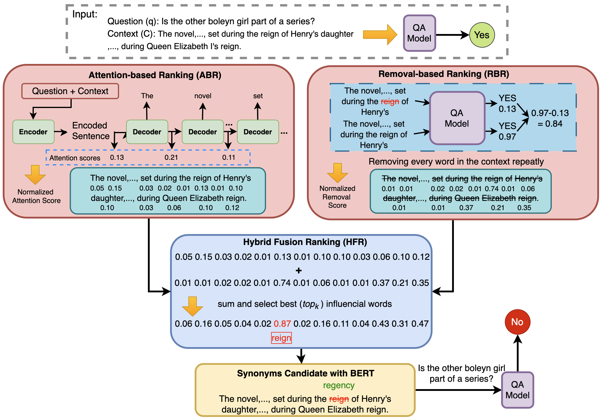

# QA-Attack

**QA-Attack: A Novel Adversarial Approach for Attacking Question Answering Systems**

## Overview



QA-Attack is a novel adversarial attack framework designed specifically to target and expose vulnerabilities in Question Answering (QA) models. By leveraging a Hybrid Ranking Fusion (HRF) algorithm that combines attention-based and removal-based ranking methods, QA-Attack identifies the most critical tokens within context passages and questions, allowing for precise and effective adversarial examples that mislead QA models while maintaining semantic coherence.

## Features

- **Hybrid Ranking Fusion (HRF) Algorithm**: Combines Attention-based Ranking (ABR) and Removal-based Ranking (RBR) to identify the most vulnerable tokens in the input.
- **Versatile Attack**: Targets both \``Informative'' and ``Boolean'' questions, demonstrating the robustness of the attack across different question types.
- **Black-box Approach**: No need for direct access to the target model’s architecture or parameters, making the attack applicable to a wide range of QA models.

## Installation

### Prerequisites

- Python 3.8
- Required Python packages (listed in `requirements.txt`)

### Installation Steps

 Clone the repository:

   ```bash
   git clone https://github.com/UTSJiyaoLi/QA-Attack.git
   cd QA-Attack
   ```
## Datasets

The QA-Attack framework is tested on multiple QA datasets. Below are the datasets used, along with links to their Hugging Face pages:

- [**SQuAD 1.1**](https://huggingface.co/datasets/squad) and [**SQuAD v2**](https://huggingface.co/datasets/rajpurkar/squad_v2): Stanford Question Answering Dataset, a reading comprehension dataset consisting of questions posed by crowdworkers on a set of Wikipedia articles.
- [**NewsQA**](https://huggingface.co/datasets/newsqa): A machine comprehension dataset consisting of questions and answers from CNN news articles.
- [**BoolQ**](https://huggingface.co/datasets/boolq): A dataset for yes/no questions containing a diverse set of questions about Wikipedia passages.
- [**NarrativeQA**](https://huggingface.co/datasets/narrativeqa): A dataset for story comprehension, where models must generate answers to questions based on summaries of books and movie scripts.

## Victim Models

The following victim models were used for evaluating the effectiveness of the QA-Attack framework:

- [**UnifiedQA**](https://huggingface.co/allenai/unifiedqa-t5-large): A general-purpose question answering model that can handle various QA formats (extractive, abstractive, multiple-choice, yes/no).
- [**BERT-base**](https://huggingface.co/bert-base-uncased): The base model for BERT (Bidirectional Encoder Representations from Transformers), fine-tuned for question answering tasks.
- [**LongT5**](https://huggingface.co/google/long-t5-local-base): A variant of T5 optimized for handling long sequences, ideal for QA tasks involving extensive context.

Ensure that you have the necessary datasets and models downloaded and set up before running the attack scripts.

## Baseline Attacks

In addition to QA-Attack, the following baseline attacks were used for comparison:

- [**TASA**](https://aclanthology.org/2022.emnlp-main.821)
- [**RobustQA**](https://arxiv.org/abs/1907.11932)
- [**Tick Me If You Can (TMYC)**](https://aclanthology.org/2020.emnlp-main.84)
- [**T3**](https://arxiv.org/abs/2112.07916)
- [**TextFooler**](https://arxiv.org/abs/1907.11932)

These baseline attacks help assess the robustness and performance of QA-Attack against other leading adversarial techniques.
